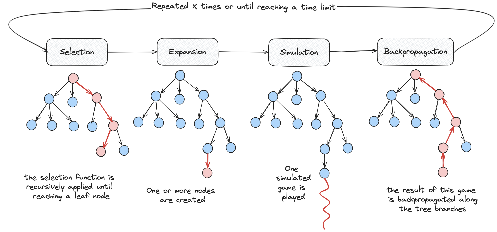

# SPAM
SPAM yields for **Single PlAyer Monte carlo tree search**. 
It is an implementation of Monte Carlo Tree Search that focuses on single-player games.

## MCTS Implementation
We provide a single-player MCTS implementation in the directory [mcts](/mcts).
Running this MCTS on your problem requires to implement three interfaces, which are:
- [IState](mcts/inc/mcts/IState.h) gathers the requirement your state must fulfill;
- [IAcation](mcts/inc/mcts/IAction.h) indicates how to compare actions;
- [IRewardFunction](mcts/inc/mcts/IRewardFunction.h) contains the reward evaluation of a given state.

The memory management of the MCTS is based on smart (``std::shared_ptr``) and raw pointers. Memory check is regularly
performed and there is no memory leak in the current implementation. In order to avoid memory issues as much
as possible, previous interfaces only use smart pointers.

An example of problem solving using this MCTS implementation is given in [takuzu](/takuzu). The takuzu is
a Sudoku-like problem that is played by a single player. 

Without getting in the details, the two main classes that are implemented
the MCTS algorithm are [MCTSAgent](mcts/inc/mcts/MCTSAgent.h) en [MCTSTree](mcts/inc/mcts/MCTSTree.h). In practice, when
using SPAM, you do not need to look at the **MCSTree** class. On its side, the **MCTSAgent** class provides the 
``run`` method that implement the iterative procedure depicted below.



When instantiating an **MCTSAgent** agent, we must give it the reward function that 
will be used during the process, but also the selection function (here UCB is provided), the maximum number of iterations we accept, and the
maximun number of seconds.

The other important class is **MCTSLoop**. Its role is to integrate the MCTS pipeline execution 
inside a loopStarting from an initial state *s0* and a given agent *a*, we will iteratively ask *a* to run an MCTS 
pipeline to generate a new state. More specifically, the input of an iteration is a state **si**, we run **a** with 
**si** as the root of the MCTS tree. When it is done, we get the best child of this tree root, or the best 
node in the tree as an output. It will become the input of the next iteration.

## MCTS Installation

We use CMake to build our project, which depends on the [nlohmann-json](https://github.com/nlohmann/json) library for 
handling json files. When building the dev environnement using cmake, you will have to previously install 
**nlohmann-json**, and to add its location into your CMAKE_PREFIX_PATH. 

Using [spack](https://github.com/spack/spack) to install dependencies, you can do the following commands

```shell
spack install nlohmann-json
```
And add such a cmake option: 
```cmake
-DCMAKE_PREFIX_PATH=/home/.../spack/opt/spack/linux-ubuntu22.04-icelake/gcc-11.4.0/nlohmann-json-3.11.2-xpjtkhg6i3k5mbh2x4yrkqsh4dxs3rl6
```
## MCTS explained

There exist many ways to implement a MCTS. The version proposed here is mainly inspired by https://gibberblot.github.io/rl-notes/single-agent/mcts.html.

## Json format for exporting trees from SPAM

The [MCTSAgent](mcts/inc/mcts/MCTSAgent.h) class allows to automatically export 
the current state of the MCTS tree in a json file. In the following pieces of codes, we activate the debug mode of the 
agent **a** before running the MCTS algorithm. The option *OUT_END_ONLY* indicates that we will 
only export the final tree. It will be written in the file  "*takuzu_0.json*".
```c++
MCTSAgent a(...)
a.activate_debug_mode("takuzu", MCTSAgent::OUT_END_ONLY);
a.run(s);
```
With the following options, one file will be written every two cycles 
```c++
a.activate_debug_mode("takuzu", MCTSAgent::OUT_ITERATION,2);
```
The generated json files will look like this.
```json
{
  "links": [
    {"child": 2, "parent": 1}, {"child": 3, "parent": 1},
    {"child": 4, "parent": 1}, {"child": 5, "parent": 1},
    ...
  ],
  "nodes": [
    {"id": 1, "reward": -11.0, "visits": 11},
    {"id": 2, "reward": -1.0, "visits": 1},
    {"id": 3, "reward": -1.0, "visits": 1
    },
    ...
  ]
}
```
## Further readings
- A research paper on the single-player problem (2008): https://dke.maastrichtuniversity.nl/m.winands/documents/CGSameGame.pdf.
- Another one that aims to "optimize" the time consumption (2008): https://dke.maastrichtuniversity.nl/m.winands/documents/pMCTS.pdf
- Aonther one, which is more recent (2021): vhttps://ojs.aaai.org/index.php/AAAI/article/view/17468.
- A recent review (2022) on the Monte Carlo Tree Search technique: https://arxiv.org/abs/2103.04931.
- A blog on SP MCTS: https://tmoer.github.io/AlphaZero/
- A lesson on MCTS: https://courses.cs.washington.edu/courses/cse599i/18wi/resources/lecture19/lecture19.pdf.
- A self-learinng single player MCTS: https://www.frontiersin.org/articles/10.3389/fnbot.2023.1039644/full.
